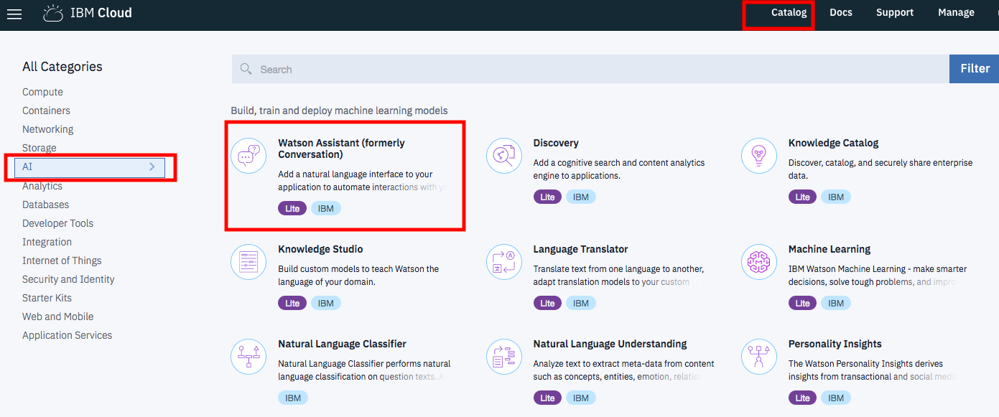
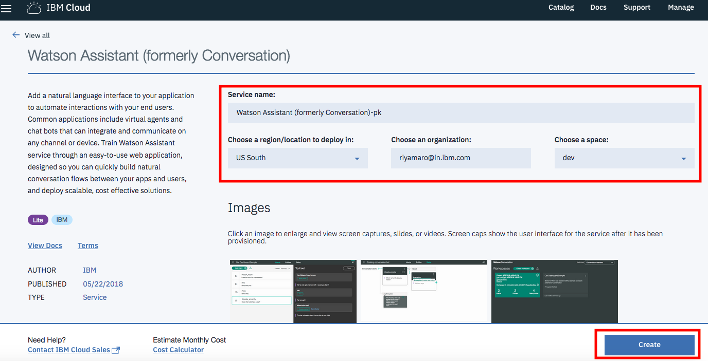
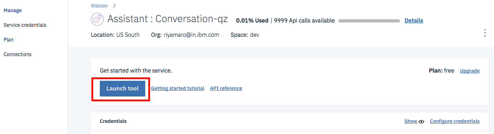
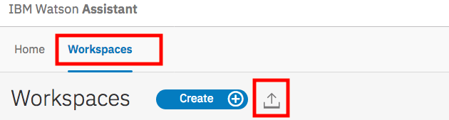
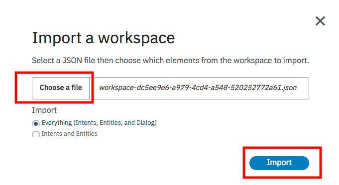
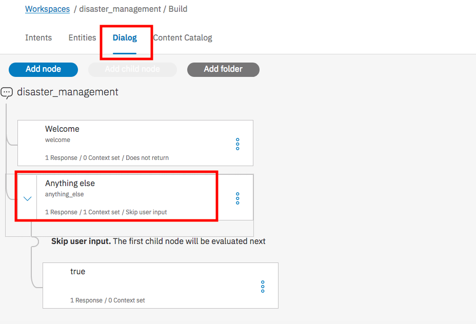
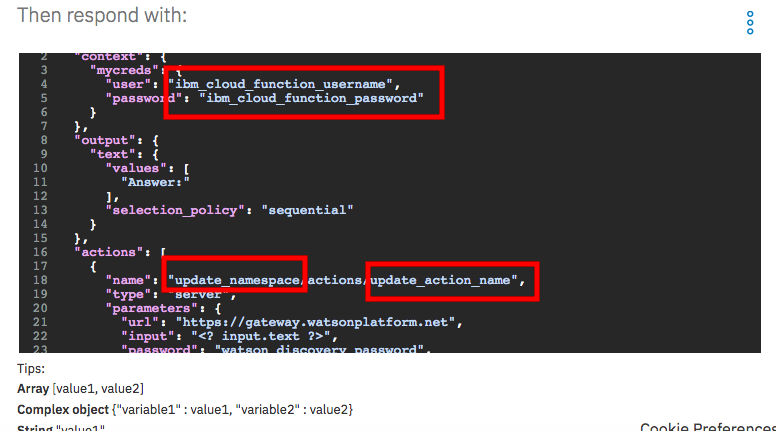
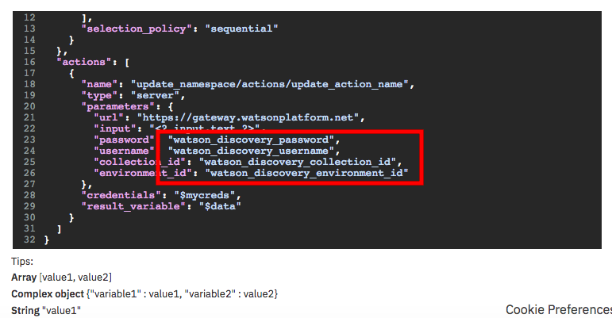

# Call for Code Day Workshop Steps

## Step 1: Clone the repo

`git clone https://github.com/IBMDevConnect/demo-callforcodeday.git`

## Step 2: Create Action in IBM Cloud Functions

Step 2.1 Click the Hamburger to open the menu

  
 
Step 2.2 Select **Functions** from menu

  

Step 2.3 Click **START CREATING** button

  
  
Step 2.4 Select **Create Action**

  

Step 2.5 Enter **Action Name**(copy Action Name in Notepad-required in later steps) and click **Create**

  

Step 2.6 Copy paste the code from [ibm_cloud_functions_code.txt](https://github.com/IBMDevConnect/demo-callforcodeday/blob/master/ibm_cloud_functions_code.txt) and click on Save

Step 2.7 Go back to Functions

  

Step 2.8 Click on **API Key**

  

Step 2.9 Take note of **Current Namespace** and **API Key** (required in later steps)

  

## Step 3: Import documents to Watson Discovery Service

### Step 3.1- Create Watson Discovery Service in IBM Cloud

### Step 3.2- Create collection within Watson Discovery service

### Step 3.3- Import documents into Watson Discovery service

### Step 3.4- Take note of Username,Password,Collection ID and Environment ID of Watson Discovery service

## Step 4: Import Watson Assistant workspace

Step 4.1 Navigate to Catalog > AI > Watson Assistant

Step 4.2 Create Watson Assistant Service

Step 4.3 Launch Tool

Step 4.4 Import Workspace by clicking on Upload icon

Step 4.5 Choose a file and click on Import

Step 4.6 Within Dialog Tab, click on **Anything Else** node

Step 4.7 Within JSON Editor, update **IBM Cloud Functions username, password, namespace and action name** (which was noted in Step 2.5 && Step 2.9 )

Also, update **Discovery service username,password, environment id and collection id** (which was noted in Step)

## Step 5: Try it Out
