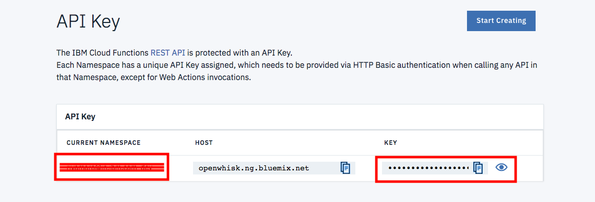

# Call for Code Day Workshop Steps

## Step 1: Clone the repo

git clone https://github.com/IBMDevConnect/demo-callforcodeday.git

## Step 2: Create Action in IBM Cloud Functions

2.1 Click the Hamburger to open the menu

  
 
2.2 Select **Functions** from menu

  

2.3 Click **START CREATING** button

  
  
2.4 Select **Create Action**

  

2.5 Enter **Action Name**(copy Action Name in Notepad-required in later steps) and click **Create**

  

2.6 Copy paste the code from [ibm_cloud_functions_code.txt](https://github.com/IBMDevConnect/demo-callforcodeday/blob/master/ibm_cloud_functions_code.txt) and click on Save

2.7 Go back to Functions

  

2.8 Click on **API Key**

  

2.9 Take note of **Current Namespace** and **API Key** (required in later steps)

  

## Step 3: Import documents to Watson Discovery Service

### Step 3.1- Create Watson Discovery Service in IBM Cloud

### Step 3.2- Create collection within Watson Discovery service

### Step 3.3- Import documents into Watson Discovery service

### Step 3.4- Take note of Username,Password,Collection ID and Environment ID of Watson Discovery service

## Step 4: Import Watson Assistant workspace

4.1 Create Watson Assistant Service in IBM Cloud

### Step 4.2- Import Workspace into Watson Assistant

### Step 4.3- Update the IBM Cloud Functions credentials and Watson Discovery service credentials

## Step 5: Try it Out
